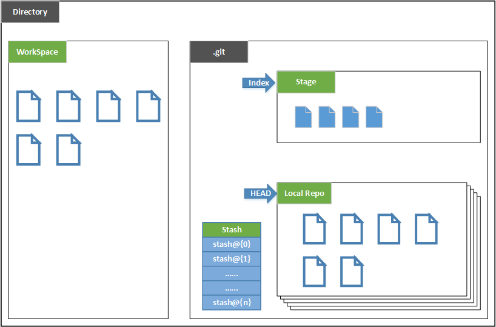
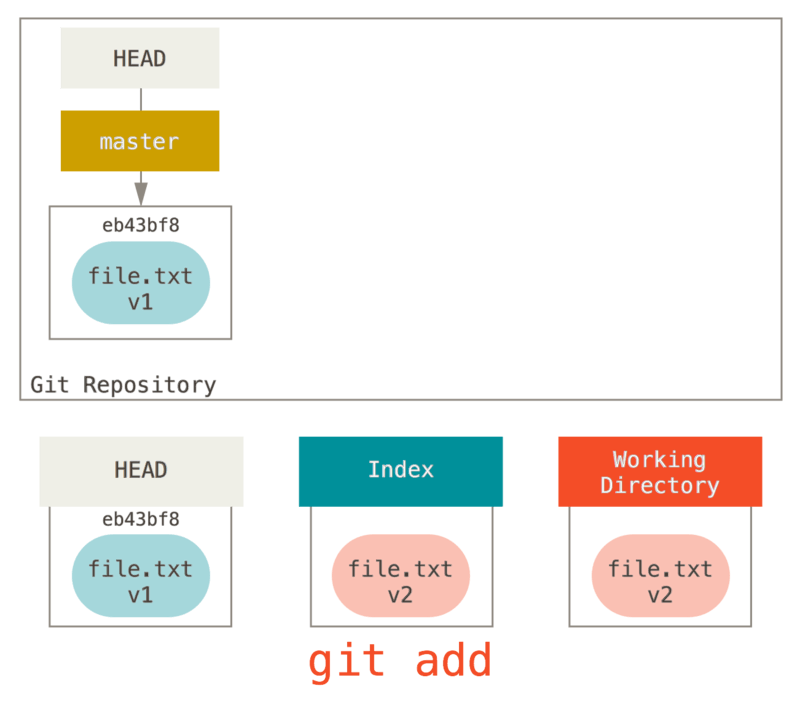
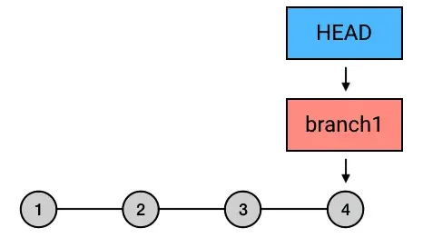

# Git总结

## Git基本配置

### 配置 user 信息（Git使用的最小配置）

- 配置 user.name

   ```shell
   git config --global user.name 'your_name'
   ```

- 配置 user.email

   ```shell
   git config --global user.email 'your_email@domain.com'
   ```

### config 的三个作用域

- 只对配置的当前仓库有效

   ```shell
   git config --local [配置项] [配置值]
   ```

- 对当前登录用户的所有仓库有效

   ```shell
   git config --global [配置项] [配置值]
   ```

- 系统所有登录的用户有效

   ```shell
   git config --system [配置项] [配置值]
   ```

### 显示配置信息，加 --list

```shell
git config --local --list
git config --global --list
git config --system --list
```

## Git 本地版本管理

### 创建 Git 本地仓库

1. 把已有的项目纳入Git管理

   ```shell
   cd 项目所在的文件夹
   git init
   ```

2. 新建的项目,直接用Git管理

   ```shell
   cd 任意文件夹
   git init your_prject # 会在当前目录下创建和项目名称同名的文件夹
   cd your_prject
   ```

3. 创建第一个仓库，并配置local信息

   ```shell
   cd 任意文件夹
   git init your_prject # 会在当前目录下创建和项目名称同名的文件夹
   cd your_prject
   git config --local user.name 'huang'
   git config --local user.email 'qyhuang@jiliason.com'
   git config --local --list
   ```

### Git 原理

#### Git 工作区域

Git本地有三个工作区域：工作目录（Working Directory）、暂存区(Stage/Index)、资源库(Repository)。

- Workspace：工作区，就是你平时存放项目代码的地方。
- Index/Stage：暂存区，用于临时存放你的改动。一般存放在 ".git目录下" 下的index文件（.git/index）中，所以我们把暂存区有时也叫作索引（index）。
- Repository：版本仓库区，就是安全存放数据的位置，这里面有你提交到所有版本的数据。其中HEAD指向最新放入仓库的版本。



- Directory：使用Git管理的一个目录，也就是一个仓库，包含我们的工作空间和Git的管理空间。
- .git：存放Git管理信息的目录，初始化仓库的时候自动创建。
- Stash：隐藏，是一个工作状态保存栈，用于保存/恢复WorkSpace中的临时状态。

#### Git 工作流程

##### 三棵树

Git 是将管理三棵不同"tree"的思维框架作为内容管理器。**tree**在这里的实际意思是 “文件的集合”，而不是指特定的数据结构。 （在某些情况下**index/stage**看起来并不像一棵树，不过我们现在的目的是用简单的方式思考它。）

Git 作为一个系统，是以它的一般操作来管理并操纵这三棵`tree`的：
| 树                | 用途                                 |
| ----------------- | ------------------------------------ |
| HEAD              | 上一次提交的快照，下一次提交的父结点 |
| Index             | 预期的下一次提交的快照               |
| Working Directory | 沙盒                                 |

- HEAD: 是当前分支引用的指针，它总是指向该分支上的最后一次提交。 这表示 HEAD 将是下一次提交的父结点。 通常，理解 HEAD 的最简方式，就是将它看做 该分支上的最后一次commit 的快照。
- Index： 是你的 预期的下一次提交。 我们也会将这个概念引用为 Git 的**暂存区**，这就是当你运行 git commit 时 Git 看起来的样子。Git 将上一次检出到**工作目录**中的所有文件填充到**暂存区**，它们看起来就像最初被检出时的样子。 之后你会将其中一些文件替换为新版本，接着通过 git commit 将它们转换为**tree**来用作新的提交。
- Working Directory:工作目录（通常也叫 工作区）。 另外两棵**tree**以一种高效但并不直观的方式，将它们的内容存储在 .git 文件夹中。 工作目录会将它们解包为实际的文件以便编辑。 你可以把工作目录当做**沙盒**。在你将修改提交到**暂存区**并记录到历史之前，可以随意更改。
  
经典的 Git 工作流程是通过操纵这三个区域来以更加连续的状态记录项目快照的。


##### 可视化工作流程

1. 进入到一个新目录，其中有一个文件。 我们称其为该文件的 v1 版本，将它标记为蓝色。 现在运行 git init，这会创建一个 Git 仓库，其中的 HEAD 引用指向未创建的 master 分支。
   

2. 要提交这个文件，所以用 git add 来获取工作目录中的内容，并将其复制到索引中。
   

3. 接着运行 git commit，它会取得索引中的内容并将它保存为一个永久的快照， 然后创建一个指向该快照的提交对象，最后更新 master 来指向本次提交。
   
   此时如果我们运行 git status，会发现没有任何改动，因为现在三棵树完全相同。

4. 现在我们想要对文件进行修改然后提交它。 我们将会经历同样的过程；首先在工作目录中修改文件。 我们称其为该文件的 v2 版本，并将它标记为红色。
   
   如果现在运行 git status，我们会看到文件显示在 “Changes not staged for commit” 下面并被标记为红色，因为该条目在索引与工作目录之间存在不同。

5. 接着我们运行 git add 来将它暂存到索引中。
   
   此时，由于索引和 HEAD 不同，若运行 git status 的话就会看到 “Changes to be committed” 下的该文件变为绿色 ——也就是说，现在预期的下一次提交与上一次提交不同。

6. 最后，我们运行 git commit 来完成提交。
   
   现在运行 git status 会没有输出，因为三棵树又变得相同了。

`git checkout [branch]`或`git clone` 的过程也类似。 当`git checkout branch`一个分支时，它会修改 `HEAD` 指向新的分支引用，将**索引** 填充为该次提交的快照， 然后将 **索引** 的内容复制到**工作目录**中。

##### Git 工作流程中的文件状态

- **Untracked**:未跟踪, 此文件在文件夹中, 但并没有加入到git库, 不参与版本控制. 通过git add 状态变为Staged.
- **Unmodify**:文件已经入库, 未修改, 即版本库中的文件快照内容与文件夹中完全一致. 这种类型的文件有两种去处, 如果它被修改, 而变为Modified.如果使用git rm移出版本库, 则成为Untracked文件
- **Modified**: 文件已修改, 仅仅是修改, 并没有进行其他的操作. 这个文件也有两个去处, 通过git add可进入暂存staged状态, 使用git checkout 则丢弃修改过,返回到unmodify状态, 这个git checkout即从库中取出文件, 覆盖当前修改。
- **Staged**: 暂存状态. 执行git commit则将修改同步到库中, 这时库中的文件和本地文件又变为一致, 文件为Unmodify状态. 执行git reset HEAD filename取消暂存,文件状态为Modified。


#### 通操作认识Git工作区、工作方式以及文件状态变化

```shell
git status # 查看工作区和暂存区的文件状态
cp [path] [file name] #拷贝文件到本地或GUI方式新建文件
git status #查看上一步创建或拷贝的文件状态。
git add [file name] #将文件添加到暂存区或者使用 git add -u 将工作区的所有跟踪的文件提交到暂存区。
git status
git commit -m 'message' #将暂存区的所有文件的更改提交到版本库，或者使用git commit -m 'message' [file name...]指定一个或多个文件提交
git status

```

#### 文件重命名

1. 手动更改

   ```shell
   mv [old file name] [new file name] #或者使用GUI方式修改
   git add [new file name] # 将修改后的文件添加到暂存区
   git rm [old file name] #将暂存区的旧文件删除。
   ```

2. Git方式

   ```shell
   git mv [old file name] [new file name] #一步到位
   ```

#### 查看版本的演变历史

##### 命令行工具查看

多屏显示控制方式：

- 空格：向下翻页
- b: 向上翻页
- q: 退出

```shell
git log # 查看当前分支，所在版本的演变历史
git log --oneline #简洁模式查看
git log -n2 #查看最近的2次版本演变历史
git log -n4 --oneline #简洁模式查看最近的4次版本演变历史
git branch -v # 查看分支。或者使用 git branch -av查看所有分支
git log --all #查看所有分支的当前所在版本演变历史。
git log --all --graph # 图形化方式的查看所有分支的版本演变历史。
git reflog # 查看当前分支，所有版本演变历史。HEAD@{移动到当前版本需要多少步}
# git log --前缀的参数可以组合使用
git --help --web [command name] #使用网页方式查看命令详细帮助
```

##### 图形界面工具查看

```shell
gitk #打开图形界面
```

#### reset命令（回滚版本和撤销commit）

`git reset`命令的本质：同时移动 HEAD 和它所指向的 branch。如下示意图


##### 基于commit的哈希值操作[推荐]

```shell
git reset --hard [哈希值]
```

##### 使用`^`符号

```shell
git reset --hard HEAD^ # 注：一个^表示回滚一个commit，n 个表示回滚n个commit
```

##### 使用`~`符号

```shell
git reset --hard HEAD~n # 注：表示回滚n个commit
```

##### 本质是操作HEAD

HEAD：是一个指针，可以指向一个分支，也可以指向一个具体的commit。


#### 分支

分支可以理解为独立的工作空间。
写文档可以根据章节创建分支，进行编辑
项目可以根据不同的功能创建分支，进行开发
修改文档里的公司logo,可根据不同的公司创建不同分支。