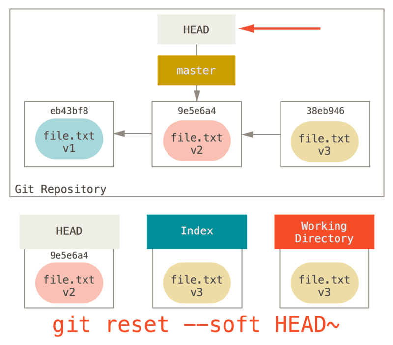

# Git总结

## Git基本配置

### 配置 user 信息（Git使用的最小配置）

- 配置 user.name

   ```shell
   git config --global user.name 'your_name'
   ```

- 配置 user.email

   ```shell
   git config --global user.email 'your_email@domain.com'
   ```

### config 的三个作用域

- 只对配置的当前仓库有效

   ```shell
   git config --local [配置项] [配置值]
   ```

- 对当前登录用户的所有仓库有效

   ```shell
   git config --global [配置项] [配置值]
   ```

- 系统所有登录的用户有效

   ```shell
   git config --system [配置项] [配置值]
   ```

### 显示配置信息，加 --list

```shell
git config --local --list
git config --global --list
git config --system --list
```

## Git 本地版本管理

### 创建 Git 本地仓库

1. 把已有的项目纳入Git管理

   ```shell
   cd 项目所在的文件夹
   git init
   ```

2. 新建的项目,直接用Git管理

   ```shell
   cd 任意文件夹
   git init your_prject # 会在当前目录下创建和项目名称同名的文件夹
   cd your_prject
   ```

3. 创建第一个仓库，并配置local信息

   ```shell
   cd 任意文件夹
   git init your_prject # 会在当前目录下创建和项目名称同名的文件夹
   cd your_prject
   git config --local user.name 'huang'
   git config --local user.email 'qyhuang@jiliason.com'
   git config --local --list
   ```

### Git 原理

#### Git 工作区域

Git本地有三个工作区域：工作目录（Working Directory）、暂存区(Stage/Index)、资源库(Repository)。

- Workspace：工作区，就是你平时存放项目代码的地方。
- Index/Stage：暂存区，用于临时存放你的改动。一般存放在 ".git目录下" 下的index文件（.git/index）中，所以我们把暂存区有时也叫作索引（index）。
- Repository：版本仓库区，就是安全存放数据的位置，这里面有你提交到所有版本的数据。其中HEAD指向最新放入仓库的版本。


- Directory：使用Git管理的一个目录，也就是一个仓库，包含我们的工作空间和Git的管理空间。
- .git：存放Git管理信息的目录，初始化仓库的时候自动创建。
- Stash：隐藏，是一个工作状态保存栈，用于保存/恢复WorkSpace中的临时状态。

#### Git 工作流程

##### 三棵树

Git 是将管理三棵不同**树**的思维框架作为内容管理器。**树**在这里的实际意思是 “文件的集合”，而不是指特定的数据结构。 （在某些情况下**index/stage**看起来并不像一棵树，不过我们现在的目的是用简单的方式思考它。）

Git 作为一个系统，是以它的一般操作来管理并操纵这三棵**树**的：
| 树                | 用途                                 |
| ----------------- | ------------------------------------ |
| HEAD              | 上一次提交的快照，下一次提交的父结点 |
| Index             | 预期的下一次提交的快照               |
| Working Directory | 沙盒                                 |

- `HEAD`: 是当前分支引用的指针，它总是指向该分支上的最后一次提交。 这表示 `HEAD` 将是下一次提交的父结点。 通常，理解 `HEAD` 的最简方式，就是将它看做 该分支上的最后一次commit 的快照。
- `Index`： 是你的 预期的下一次提交。 我们也会将这个概念引用为 Git 的**暂存区**，这就是当你运行 `git commit` 时 Git 看起来的样子。Git 将上一次检出到**工作目录**中的所有文件填充到**暂存区**，它们看起来就像最初被检出时的样子。 之后你会将其中一些文件替换为新版本，接着通过 `git commit` 将它们转换为**树**来用作新的提交。
- `Working Directory`:工作目录（通常也叫 工作区）。 另外两棵**树**以一种高效但并不直观的方式，将它们的内容存储在 `.git` 文件夹中。 工作目录会将它们解包为实际的文件以便编辑。 你可以把工作目录当做**沙盒**。在你将修改提交到**暂存区**并记录到历史之前，可以随意更改。
  
经典的 Git 工作流程是通过操纵这三个区域来以更加连续的状态记录项目快照的。


##### 可视化工作流程

1. 进入到一个新目录，其中有一个文件。 我们称其为该文件的 v1 版本，将它标记为蓝色。 现在运行 `git init`，这会创建一个 Git 仓库，其中的 `HEAD` 引用指向未创建的 `master` 分支。
   

2. 要提交这个文件，所以用 `git add` 来获取工作目录中的内容，并将其复制到索引中。
   

3. 接着运行 `git commit`，它会取得索引中的内容并将它保存为一个永久的快照， 然后创建一个指向该快照的提交对象，最后更新 master 来指向本次提交。
   
   此时如果我们运行 `git status`，会发现没有任何改动，因为现在三棵树完全相同。

4. 现在我们想要对文件进行修改然后提交它。 我们将会经历同样的过程；首先在工作目录中修改文件。 我们称其为该文件的 v2 版本，并将它标记为红色。
   
   如果现在运行 git status，我们会看到文件显示在 “Changes not staged for commit” 下面并被标记为红色，因为该条目在索引与工作目录之间存在不同。

5. 接着我们运行 git add 来将它暂存到索引中。
   
   此时，由于索引和 `HEAD` 不同，若运行 `git status` 的话就会看到 “Changes to be committed” 下的该文件变为绿色 ——也就是说，现在预期的下一次提交与上一次提交不同。

6. 最后，我们运行 `git commit` 来完成提交。
   
   现在运行 `git status` 会没有输出，因为三棵树又变得相同了。

`git checkout [branch]`或`git clone` 的过程也类似。 当`git checkout branch`一个分支时，它会修改 `HEAD` 指向新的分支引用，将**索引** 填充为该次提交的快照， 然后将 **索引** 的内容复制到**工作目录**中。

##### Git 工作流程中的文件状态

- **Untracked**:未跟踪, 此文件在文件夹中, 但并没有加入到git库, 不参与版本控制. 通过git add 状态变为Staged.
- **Unmodify**:文件已经入库, 未修改, 即版本库中的文件快照内容与文件夹中完全一致. 这种类型的文件有两种去处, 如果它被修改, 而变为Modified.如果使用git rm移出版本库, 则成为Untracked文件
- **Modified**: 文件已修改, 仅仅是修改, 并没有进行其他的操作. 这个文件也有两个去处, 通过git add可进入暂存staged状态, 使用git checkout 则丢弃修改过,返回到unmodify状态, 这个git checkout即从库中取出文件, 覆盖当前修改。
- **Staged**: 暂存状态. 执行git commit则将修改同步到库中, 这时库中的文件和本地文件又变为一致, 文件为Unmodify状态. 执行git reset HEAD filename取消暂存,文件状态为Modified。


#### 通操作认识Git工作区、工作方式以及文件状态变化

```shell
git status # 查看工作区和暂存区的文件状态
cp [path] [file name] #拷贝文件到本地或GUI方式新建文件
git status #查看上一步创建或拷贝的文件状态。
git add [file name] #将文件添加到暂存区或者使用 git add -u 将工作区的所有跟踪的文件提交到暂存区。
git status
git commit -m 'message' #将暂存区的所有文件的更改提交到版本库，或者使用git commit -m 'message' [file name...]指定一个或多个文件提交
git status

```

### 文件重命名

1. 手动更改

   ```shell
   mv [old file name] [new file name] #或者使用GUI方式修改
   git add [new file name] # 将修改后的文件添加到暂存区
   git rm [old file name] #将暂存区的旧文件删除。
   ```

2. Git方式

   ```shell
   git mv [old file name] [new file name] #一步到位
   ```

### 删除文件

1. 手动更改

   ```shell
   rm [file name] 
   git rm [file name] #将暂存区的旧文件删除。
   ```

2. Git方式

 ```shell
 git rm [file name]
```

### 查看commit版本的演变历史

#### 命令行工具查看

多屏显示控制方式：

- 空格：向下翻页
- b: 向上翻页
- q: 退出

```shell
git log # 查看当前分支，所在版本的演变历史
git log --oneline #简洁模式查看
git log -n2 #查看最近的2次版本演变历史
git log -n4 --oneline #简洁模式查看最近的4次版本演变历史
git branch -v # 查看分支。或者使用 git branch -av查看所有分支
git log --all #查看所有分支的当前所在版本演变历史。
git log --all --graph # 图形化方式的查看所有分支的版本演变历史。
git reflog # 查看当前分支，所有版本演变历史。HEAD@{移动到当前版本需要多少步}
# git log --前缀的参数可以组合使用
git --help --web [command name] #使用网页方式查看命令详细帮助
```

#### 图形界面工具查看

```shell
gitk #打开图形界面
```

### 回滚和撤销

#### `reset`命令

`reset`以一种简单可预见的方式直接操纵**三棵树**，实现重置的功能（包括版本回滚和撤销commit，以及文件）。 它做了三步基本操作:

1. `reset`移动`HEAD`的**指向**。
2. 更新索引（--mixed）
3. 更新工作目录（--hard）

#### 回滚和撤销commit

##### 演示可视化`reset`三步基本操作

假设我们修改 file.txt 文件并三次提交它。 历史看起来是这样的：


###### 第 1 步：移动 HEAD（--soft）

`reset` 做的第一件事是移动`HEAD`的**指向**,或者可以理解为同时移动 HEAD 和它所指向的 branch。如下示意图

这与改变`HEAD`自身不同（`checkout`所做的，即改变自身）；`reset`移动`HEAD`指向的**分支**。 这意味着如果 `HEAD` 设置为 `master` 分支（例如，你正在`master`分支上），运行`git reset 9e5e6a4`将会使`master`指向`9e5e6a4`。

无论你调用了何种形式的带有一个提交的 reset，它首先都会尝试这样做。 如果指定 `--soft` 选项，它将仅仅完成这步。

现在看一眼上图，理解一下发生的事情：它本质上是**撤销**了上一次 `git commit` 命令。 当你在运行 `git commit` 时，Git 会创建一个新的提交，并移动 **`HEAD` 所指向的分支**来使其指向该提交。 当你将它 `reset` 回 `HEAD~`（`HEAD` 的父结点）时，其实就是把该分支移动回原来的位置，而不会改变索引和工作目录。

###### 第 2 步：更新索引（--mixed）

注意，如果你现在运行 `git status` 的话，就会看到新的 `HEAD` 和以绿色标出的它和索引之间的区别。

接下来，`reset` 会用 `HEAD` 指向的当前快照的内容来**更新索引**。

如果指定 `--mixed` 选项，`reset` 将会在这步完成时停止。 这也是**默认行为**，所以如果没有指定任何选项（在本例中只是 git reset HEAD~），这就是命令将会停止的地方。

现在再看一眼上图，理解一下发生的事情：它依然会撤销一上次 提交，但还会 取消暂存 所有的东西。 于是，我们回滚到了所有 `git add` 和 `git commit` 的命令执行之前。

###### 第 3 步：更新工作目录（--hard）

`reset` 要做的的第三件事情就是让**工作目录**看起来像**索引**。 如果使用 `--hard` 选项，它将会继续这一步。

现在让我们回想一下刚才发生的事情。 你撤销了最后的提交、git add 和 git commit 命令 以及 工作目录中的所有工作。

**必须注意**：

`--hard` 标记是`reset` 命令唯一的**危险用法**，它也是 Git 会真正地销毁数据的仅有的几个操作之一。 其他任何形式的 reset 调用都可以轻松撤消，但是 `--hard` 选项不能，因为它**强制覆盖了工作目录中的文件**。 在这种特殊情况下，我们的 Git 数据库中的一个提交内还留有该文件的 v3 版本， 我们可以通过 `reflog` 来找回它。但是若该文件还未提交，Git 仍会覆盖它从而导致无法恢复。

**销毁的数据**：

- `--hard` 标记是`reset`销毁的数据是所有未提交的数据（包括未添加到暂存区的文件修改和暂存区的所有数据）。
- reset（包括三个选项）后，已提交的历史数据（**处于detached HEAD头指针分离状态**）可通过`reflog` 来找回它，但是`reflog`的有效期默认为90天。过期或者手动删除`reflog`将找不回已提交的历史数据。详情可查看`git reflog`命令。

###### `reset`命令三个选项区别

- `--soft`：只移动`HEAD`的**指向**。
  
  所以效果看起来就缓存区和工作目录都不会被改变，只是原节点和Reset节点之间的所有**差异都会放到暂存区**中。
  >**常用操作**：
  >
  >1. 合并提交：开发一个功能，阶段性地频繁提交。可以考虑使用`reset --soft`来合并之前的`commit`，让 commit演进线路更为清晰。

- --mixed（默认）：移动`HEAD`的**指向**同时，会用 `HEAD` 指向的当前快照的内容来**更新索引**。所以效果看起来就是缓存区和你指定的提交同步，但工作目录不受影响。原节点和Reset节点之间的所有**差异都会放到工作目录**中。
  
  >**常用操作**：
  >
  >1. 清空暂存区：有时添加了不想要的或错误的文件和修改内容到暂存区，这时可使用`git reset Head`清空暂存区。
  >2. 重置（撤销）本次commit：commit后，知道这次commit了错误或不想commit的数据。这时可使用`git reset Head~`或`git reset Head^`

- --hard：
  
  移动`HEAD`的**指向**，会用 `HEAD` 指向的当前快照的内容来**更新索引**,再更新工作目录，让**工作目录**看起来像**索引**。所以效果看起来缓存区和工作目录都**同步到你指定的提交**。

  >**常用操作**：
  >
  >1. 放弃本次所有未提交的本地编辑内容:
  可以执行 `git reset -hard HEAD` 来强制清理掉当前的所有更改。
  >2. 回滚版本和撤销某节点后的所有commit:有时某节点到原节点之间的commit提交都是错了，或者是某一版本之后出现未知Bug,导致无法使用。
  >
  >```shell
  >   git reset --hard [标识commit的哈希值] # 回滚到指定commit
  >   git reset --hard HEAD^ # 注：一个^表示回滚一个commit，n 个表示回滚n个commit
  >   git reset --hard HEAD~n # 注：表示回滚n个commit
  >   ```

#### 回滚和撤销文件

上一章节讲述了 `reset` 基本形式的行为，我们还可以给它提供一个作用文件路径。 若指定了一个路径，`reset` 将会跳过第 1 步，并且将它的**作用范围限定**为指定的文件或文件集合。这样做是因为 `HEAD` 只是一个指针，你无法让它同时指向两个commit中各自的一部分。 不过**索引**和**工作目录**可以部分更新，所以会继续进行第 2、3 步。

假如Git的状态为：

我们运行 `git reset file.txt` （这其实是 `git reset --mixed HEAD file.txt` 的简写形式，因为你既没有指定一个提交的 `SHA-1` 或`branch`，也没有指定 --soft 或 --hard），它会：

1. 移动 HEAD 分支的指向 （已跳过）
2. 让**索引/暂存区**看起来像 HEAD （到此处停止）

所以它本质上只是将 file.txt 从 HEAD 复制到索引中。


它还有 **取消暂存文件** 的实际效果。 如果我们查看该命令的示意图，然后再想想 git add 所做的事，就会发现它们正好相反。


这就是为什么 git status 命令的输出会建议运行此命令来取消暂存一个文件。

我们可以不让Git从 `HEAD` 拉取数据，而是通过具体指定一个`commit`来拉取该文件的对应版本。 我们只需运行类似于 `git reset [commit 哈希值] [文件相对路径]` 的命令即可。


它其实做了同样的事情，也就是把**索引/暂存区**中的文件恢复到 v1 版本，运行 `git add` 添加它， 然后再将它恢复到 v3 版本（只是不用真的过一遍这些步骤）。 如果我们现在运行 `git commit`，它就会记录一条“将该文件恢复到 v1 版本”的更改， 尽管我们并未在工作目录中真正地再次拥有它。

### 分离头指针（detached HEAD）

本质：正工作在一个没有分支的状态下。

风险：分离头指针状态下的所有提交，如果最后没有和分支进行挂钩，在切换到其他分支后，可通过`reflog` 来找回它，默认有效期90天。之后会被Git当垃圾清理掉。

好处：可以基于某个commit进行修改，提交。

### Git 存储机制

#### Git 对象

1. `blob` 对象（保存着文件快照）
2. `tree` 对象 （记录着目录结构和 blob 对象索引）以及一个
3. `commit` 对象（包含着指向前述tree对象的指针和所有commit信息）

#### Git 对象之间的关系

1. 一个commit对象对应一个tree对象
2. tree可以嵌套，文件夹在Git 里也是tree.
3. 一个tree可保护多个blob,嵌套多个tree.
4. commit对象及其树结构
   
   

5. commit对象及其父对象
   

>Note:Git 是根据文件内容产生blob对象，因此文件内容相同那么对象就相同。

### 分支（branch)

#### 简介

分支意味着你可以把你的工作从开发主线上分离开来，以免影响开发主线。
>分支在实际使用中可以理解为独立的工作空间。

Git 的分支，其实本质上仅仅是指向`commit对象`的**可变指针**。 Git 的默认分支名字是 master。 在多次提交操作之后，你其实已经有一个指向最后那个提交对象的 master 分支。 master 分支会在每次提交时自动向前移动。
>Git 的 master 分支并不是一个特殊分支。 它就跟其它分支完全没有区别。 之所以几乎每一个仓库都有 master 分支，是因为 git init 命令默认创建它，并且大多数人都懒得去改动它。

#### 分支管理

##### 分支创建

Git 创建新分支，只是为你创建了一个可以移动的新的指针。 比如，创建一个 testing 分支， 你需要使用 git branch 命令：

```shell
git branch testing
```

这会在当前所在的commit对象上创建一个指针。


在 Git 中，`HEAD`是一个特殊指针，它指向当前所在的本地分支（译注：将 `HEAD` 想象为当前分支的别名）。 在本例中，你仍然在 `master` 分支上。 因为 `git branch` 命令仅仅创建 一个新分支，并**不会自动切换**到新分支中去。


使用 git log 命令查看各个分支当前所指的对象。 提供这一功能的参数是 --decorate。

```shell
$ git log --oneline --decorate
f30ab (HEAD -> master, testing) add feature #32 - ability to add new formats to the central interface
34ac2 Fixed bug #1328 - stack overflow under certain conditions
98ca9 The initial commit of my project
```

正如你所见，当前 master 和 testing 分支均指向校验和以 f30ab 开头的提交对象。

**创建分支的命令总结**：

```shell
git branch [new branch name] #在当前所在的commit对象上创建一个分支
git checkout -b [new branch name]#在当前所在的commit对象上创建一个分支，并切换到创建的新分支
git branch [new branch name] [commit]# 创建基于commit上的分支
git checkout -b [new branch name] [branch|commit] # 创建基于分支或提交的分支，并切换到创建的新分支
```

##### 分支查看

```shell
git branch # 不加任何参数运行它，会得到当前所有分支的一个列表
git branch -v # 查看每一个分支的最后一次提交
git branch --merged # --merged 与 --no-merged 这两个有用的选项可以过滤这个列表中已经合并或尚未合并到当前分支的分支。
git branch -a # 列出远程跟踪分支和本地分支。
```

注意 master 分支前的 * 字符：它代表现在checkout的那一个分支（也就是说，当前 HEAD 指针所指向的分支）。

##### 分支切换

###### `checkout`命令

`checkout` ：和 `reset` 一样，也操纵三棵树。实现切换的功能， 它做了三步基本操作:

1. `checkout`只移动`HEAD`
2. 更新索引
3. 更新工作目录

和`reset`命令的区别：**变更暂存区使用reset命令，变更工作区使用checkout命令。**

1. `reset` 会移动 `HEAD` 分支的**指向**，而 `checkout` 只会移动 `HEAD` **自身**来指向另一个分支。
2. `checkout` 对工作目录是安全的，它会通过检查来确保不会将已更改的文件弄丢。 其实它还更聪明一些。它会在工作目录中先试着简单合并一下，这样所有**还未修改过的**文件都会被更新。 而 `reset --hard` 则会不做检查就全面地替换所有东西。


>运行 `checkout` 的另一种方式就是指定一个文件路径，这会像 `reset` 一样不会移动 `HEAD`。 它就像 `git reset [branch] file` 那样用该次提交中的那个文件来更新索引，但是它也会覆盖工作目录中对应的文件。 它就像是 `git reset --hard [branch] file`（如果 `reset` 允许你这样运行的话）， 这样对工作目录并不安全，它也不会移动 `HEAD`。

要切换到一个已存在的分支，你需要使用 git checkout 命令。我们现在切换到新创建的 testing 分支去：

```shell
git checkout testing
```

这样 HEAD 就指向 testing 分支了。


那么，这样的实现方式会给我们带来什么好处呢？ 现在不妨再提交一次：

```shell
vim test.rb
git commit -a -m 'made a change'
```


如图所示，你的 `testing` 分支向前移动了，但是 `master` 分支却没有，它仍然指向运行 `git checkout` 时所指的对象。 这就有意思了，现在我们切换回 `master` 分支看看：

```shell
git checkout master
```


这条命令做了两件事。 一是使 `HEAD` 指回 `master` 分支，二是将工作目录恢复成 `master` 分支所指向的快照内容。 也就是说，你现在做修改的话，项目将始于一个较旧的版本。 本质上来讲，这就是忽略 testing 分支所做的修改，以便于向另一个方向进行开发。

>**分支切换会改变你工作目录中的文件**
>
>在切换分支时，一定要注意你工作目录里的文件会被改变。 如果是切换到一个较旧的分支，你的工作目录会恢复到该分支最后一次提交时的样子。 如果 Git 不能干净利落地完成这个任务，它将禁止切换分支。

##### 分支合并

###### `git merge`命令合并分支

例如：合并 iss53 分支到 master 分支

```shell
git checkout master # 切换到master
git merge iss53 # 将iss53合并入master分支。
```


修改已经合并进来了，就不再需要 iss53 分支了。 现在你可以在任务追踪系统中关闭此项任务，并删除这个分支。

###### 遇到冲突时的分支合并

两个不同的分支中，对同一个文件的同一个部分进行了不同的修改，Git 就没法处理，哪些是需要保留的。Git 会暂停下来，等待你去解决合并产生的冲突。

任何因包含合并冲突而有待解决的文件，都会以**未合并状态标识**出来。 Git 会在有冲突的文件中加入标准的冲突解决标记，这样你可以打开这些包含冲突的文件然后手动解决冲突。 出现冲突的文件会包含一些特殊区段，看起来像下面这个样子：

```shell

<<<<<<< HEAD:index.html # (当前更改)
<div id="footer">contact : email.support@github.com</div>
=======
<div id="footer">
 please contact us at support@github.com
</div>
>>>>>>> iss53:index.html (传入的更改)
```

这表示 HEAD 所指示的版本（也就是你的 master 分支所在的位置，因为你在运行 merge 命令的时候已经检出到了这个分支）在这个区段的上半部分（======= 的上半部分），而 iss53 分支所指示的版本在 ======= 的下半部分。

**解决冲突步骤**：

1. 为了解决冲突，你必须选择使用由 ======= 分割的两部分中的一个，或者你也可以自行合并这些内容。
2. 运行 git status 来确认所有的合并冲突都已被解决
3. 确定之前有冲突的的文件都已经暂存了，这时你可以输入 git commit 来完成合并提交。

##### 分支删除

```shell
git branch -d iss53 #删除已经合并的分支
git branch -D iss53 #强制删除为合并的分支
```

### 修改commit 的 message

#### 修改最新的commit的message

  ```shell
  git commit amend
  ```

#### 修改历史的commit的message
  
  ```shell
  git rebase -i [commit] # 交互
  ```

### 比较文件差异

1. 比较暂存区和HEAD所含文件差异

   ```shell
   git diff --cached
   ```

2. 比较工作区和暂存区

   ```shell
   git diff # 比较所有文件差异
   git diff -- [<filepath>...]# 比较一个或多个文件差异
   ```

### 恢复文件

1. 暂存区恢复成HEAD一样

   ```shell
   git reset HEAD #恢复全部
   git reset HEAD -- [<filepath>...] #恢复一个或多个文件
   ```

2. 工作区恢复成暂存区一样

   ```shell
   git checkout -- [<filepath>...] #恢复一个或多个文件
   ```

### Git 的备份

#### 常用协议

| 常用协议       | 语法格式                                                                                                            | 说明     |
| -------------- | ------------------------------------------------------------------------------------------------------------------- | -------- |
| 本地协议（1）  | `/path/to/repo.git`                                                                                                 | 哑协议   |
| 本地协议（2）  | `file:///path/to/repo.git`                                                                                          | 智能协议 |
| http/https协议 | <div> `http://git-server.com:port/path/to/repo.git`</div> <div>`https://git-server.com:port/path/to/repo.git`</div> | 智能协议 |
| ssh协议        | `user@git-server.com:path/to/repo.git `                                                                             | 智能协议 |

>哑协议和智能协议的区别：
>直观区别：哑协议传输进度不可见，智能协议传输进度可见
>传输速度：智能协议比哑协议快。

#### 本地备份

##### 备份文件夹操作方式

1. 在本地创建一个备份文件夹
2. 直接克隆一个要备份的项目到本地仓库

```shell

# 克隆一个没有工作区的裸仓库。window 的路径：E:\folder\.git 转成git 路径为：/e/folder/.git例如：git clone --bare /e/hqy/学习/Git/.git testya.git或者使用智能协议git clone --bare file:///e/hqy/学习/Git/.git testya.git

git remote clone --bare [本地路径] [备份的仓库名字]
```

##### 项目文件夹操作方式

1. 在本地创建一个备份文件夹
2. 在项目工作目录操作：

```shell
git remote -v # 查看远程仓库和本地备份仓库列表
# git remote add localRep file:///e/GitbackupTest/localRep.git  添加本地仓库
# git remote add remoteRep https://git-server.com:port/path/to/repo.git  添加远程仓库
# 添加远程仓库，
git remote add [备份仓库名] [对应的协议地址]
# 将数据推送到仓库
git push [备份仓库名]

```


写文档可以根据章节创建分支，进行编辑
项目可以根据不同的功能创建分支，进行开发
修改文档里的公司logo,可根据不同的公司创建不同分支。